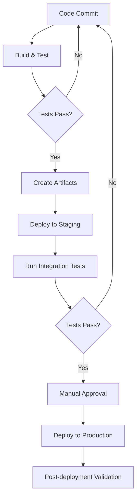

# Deployment and Infrastructure

This document outlines the deployment architecture, infrastructure setup, and operational procedures for the User Health Data Management Platform.

## Infrastructure Architecture

### System Architecture

The platform uses a microservices architecture deployed across multiple environments:


#### Environments

| Environment | Purpose | Access | Data |
|-------------|---------|--------|------|
| Development | Local development and testing | Developers only | Synthetic test data |
| Staging | Pre-production testing | Internal team and testers | Anonymized data |
| Production | Live system | End users | Real user data |

### Cloud Infrastructure

The platform is hosted on AWS with the following core services:

- **Compute**: AWS ECS (Elastic Container Service)
- **Database**: Amazon RDS (PostgreSQL) and MongoDB Atlas
- **Storage**: Amazon S3 for file storage
- **CDN**: Amazon CloudFront for static content delivery
- **DNS**: Amazon Route 53
- **Load Balancing**: Application Load Balancer (ALB)
- **Monitoring**: Amazon CloudWatch and Datadog
- **Logging**: ELK Stack (Elasticsearch, Logstash, Kibana)

## Deployment Architecture

### Backend Services

The backend is deployed as containerized microservices:

- **Authentication Service**: User authentication and authorization
- **User Service**: User profile management
- **Health Record Service**: Health data storage and retrieval
- **OCR Processing Service**: Medical report parsing
- **Analytics Service**: Health data analysis and risk assessment
- **API Gateway**: Route and manage API requests

### Frontend Deployment

- **Web Application**: Static site hosted on S3 and delivered via CloudFront
- **iOS Application**: Distributed through Apple App Store
- **Android Application**: Distributed through Google Play Store

### Database Architecture

- **PostgreSQL**: Relational data (users, permissions, metadata)
- **MongoDB**: Document storage (health records, medical reports)
- **Redis**: Caching and session management

### Data Flow

1. Client requests are routed through CloudFront and API Gateway
2. API Gateway authenticates and routes to appropriate services
3. Services process requests and interact with databases
4. Responses are returned to clients through the same path

## Deployment Process

### CI/CD Pipeline

The platform uses a fully automated CI/CD pipeline:

1. **Code Push**: Developer pushes code to GitHub repository
2. **Build**: GitHub Actions builds and tests the application
3. **Artifact Creation**: Docker images and deployment packages are created
4. **Deployment**: Infrastructure as Code (Terraform) deploys resources
5. **Validation**: Automated tests validate the deployment
6. **Promotion**: Manual approval for production deployment

### Deployment Workflow



### Release Strategy

#### Release Types

- **Patch Releases**: Bug fixes and minor changes (weekly)
- **Minor Releases**: New features and improvements (monthly)
- **Major Releases**: Significant platform changes (quarterly)

#### Deployment Windows

- **Staging**: Any time during business hours
- **Production**: Tuesday and Thursday, 10:00 PM - 2:00 AM ET

#### Rollback Procedure

1. Identify the need for a rollback
2. Rollback request and approval process
3. Execute rollback deployment
4. Verify system stability after rollback
5. Root cause analysis

## Infrastructure as Code

All infrastructure is managed through IaC using Terraform:

```
infrastructure/
├── environments/
│   ├── dev/
│   ├── staging/
│   └── prod/
├── modules/
│   ├── networking/
│   ├── compute/
│   ├── database/
│   ├── storage/
│   └── monitoring/
└── scripts/
```

### Key Terraform Modules

- **VPC and Networking**: Subnets, security groups, and routing
- **ECS Clusters**: Container orchestration for microservices
- **RDS and MongoDB**: Database configuration
- **S3 and CloudFront**: Storage and content delivery
- **Monitoring and Logging**: Observability setup

## Environment Configuration

### Environment Variables

Environment-specific configuration is managed through environment variables:

```
# Database Configuration
DB_HOST=db.example.com
DB_PORT=5432
DB_NAME=healthdb
DB_USER=dbuser
DB_PASSWORD=******

# AWS Configuration
AWS_REGION=us-east-1
S3_BUCKET=health-reports
CLOUDFRONT_URL=https://d12345.cloudfront.net

# Application Configuration
API_URL=https://api.healthplatform.com
LOG_LEVEL=info
FEATURE_FLAGS={"new_dashboard":true,"voice_input":false}
```

### Secrets Management

- AWS Secrets Manager for sensitive credentials
- HashiCorp Vault for service-to-service authentication
- Encryption of all sensitive data at rest and in transit

## Monitoring and Observability

### Monitoring Strategy

- **Real-time Monitoring**: Dashboard for system health and performance
- **Alerts**: Threshold-based alerts for key metrics
- **Log Analysis**: Centralized logging with search and visualization
- **User Experience Monitoring**: Real User Monitoring (RUM)

### Key Metrics

#### System Metrics

- **CPU and Memory Usage**: Server resource utilization
- **Network Traffic**: Inbound and outbound traffic
- **Error Rate**: Application and system errors
- **Response Time**: API and page load times

#### Business Metrics

- **Active Users**: Daily and monthly active users
- **Report Uploads**: Number and types of health reports
- **Assessment Completions**: Number of completed health assessments
- **Conversion Rate**: User journey conversion metrics

### Alert Thresholds

| Metric | Warning | Critical | Action |
|--------|---------|----------|--------|
| API Response Time | >500ms | >1s | Auto-scale application servers |
| Error Rate | >1% | >5% | Page on-call engineer |
| CPU Usage | >70% | >90% | Auto-scale or investigate |
| Disk Usage | >70% | >90% | Expand storage or clean up |

## Backup and Disaster Recovery

### Backup Strategy

- **Database Backups**: Automated daily backups with point-in-time recovery
- **File Backups**: S3 versioning and cross-region replication
- **Configuration Backups**: Infrastructure as Code repository

### Backup Schedule

| Resource | Frequency | Retention | Location |
|----------|-----------|-----------|----------|
| PostgreSQL | Hourly | 24 hours | Same region |
| PostgreSQL | Daily | 30 days | Cross-region |
| PostgreSQL | Monthly | 1 year | Cross-region |
| MongoDB | Daily | 30 days | Cross-region |
| S3 Data | Continuous | 90 days | Cross-region |

### Disaster Recovery Plan

#### Recovery Time Objective (RTO)

- **Critical Systems**: 4 hours
- **Non-critical Systems**: 24 hours

#### Recovery Point Objective (RPO)

- **User Data**: 1 hour
- **Analytics Data**: 24 hours

### DR Scenarios

1. **Single Service Failure**
   - Auto-healing through container orchestration
   - Automatic failover for stateful services

2. **Availability Zone Failure**
   - Multi-AZ deployment for high availability
   - Automatic failover to standby AZ

3. **Region Failure**
   - Cross-region database replicas
   - Manual failover to DR region

## Scalability Plan

### Scaling Dimensions

- **Horizontal Scaling**: Add more service instances
- **Vertical Scaling**: Increase resource allocation
- **Data Partitioning**: Shard databases by user groups

### Auto-scaling Configuration

- **ECS Services**: Scale based on CPU/memory utilization
- **Database**: Increase instance size as needed
- **Load Balancing**: Distribute traffic across instances

### Growth Planning

| User Count | Infrastructure Changes |
|------------|------------------------|
| <10K | Single region, basic setup |
| 10K-100K | Multi-AZ, enhanced monitoring |
| 100K-1M | Multi-region, database sharding |
| >1M | Global distribution, custom CDN configuration |

## Security Measures

### Infrastructure Security

- **Network Security**: VPC isolation, security groups, and NACLs
- **Access Control**: IAM roles and policies with least privilege
- **DDoS Protection**: AWS Shield and AWS WAF
- **Data Encryption**: Encryption at rest and in transit

### Compliance Controls

- **HIPAA Compliance**: Technical safeguards for PHI
- **SOC 2**: Controls for security, availability, and confidentiality
- **GDPR**: Data protection measures for EU users

### Security Monitoring

- **Security Information and Event Management (SIEM)**: Centralized security monitoring
- **Vulnerability Scanning**: Regular infrastructure and application scanning
- **Penetration Testing**: Annual third-party penetration testing

## Operational Procedures

### Deployment Procedures

#### Standard Deployment

1. Create deployment request in deployment management system
2. Automated testing in staging environment
3. Deployment approval by product owner
4. Scheduled deployment to production
5. Post-deployment validation

#### Emergency Deployment

1. Emergency change request with justification
2. Expedited testing in staging environment
3. Emergency approval by engineering lead
4. Immediate deployment to production
5. Enhanced monitoring post-deployment

### Incident Response

#### Incident Severity Levels

| Level | Description | Response Time | Notification |
|-------|-------------|---------------|-------------|
| P1 | Service unavailable | Immediate | All teams, executives |
| P2 | Degraded performance | <30 minutes | Engineering, product |
| P3 | Non-critical issues | <4 hours | Engineering team |
| P4 | Minor issues | Next business day | Relevant team members |

#### Incident Response Workflow

1. **Detection**: Identify incident through monitoring or reports
2. **Triage**: Assess severity and impact
3. **Response**: Assign resources and begin resolution
4. **Resolution**: Implement fix and verify service restoration
5. **Post-mortem**: Analyze root cause and prevention

### Maintenance Windows

- **Planned Maintenance**: Tuesday and Thursday, 10:00 PM - 2:00 AM ET
- **Database Maintenance**: Sunday, 12:00 AM - 4:00 AM ET
- **Emergency Maintenance**: As needed with appropriate notification

## Documentation

### Infrastructure Documentation

- Network diagrams
- Service dependency maps
- Database schemas
- Backup and recovery procedures

### Runbooks

- Service deployment and rollback
- Database maintenance
- Scaling procedures
- Incident response
- Disaster recovery

### Change Management

- Change request templates
- Approval workflows
- Risk assessment guidelines
- Change calendar

## Cost Optimization

### Cost Monitoring

- AWS Cost Explorer for resource usage tracking
- Cost allocation tags for team/feature attribution
- Monthly cost reviews and optimization

### Optimization Strategies

- Reserved Instances for stable workloads
- Spot Instances for batch processing
- Auto-scaling for efficient resource utilization
- Storage lifecycle policies for data archiving