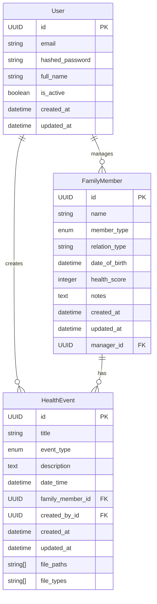

# System Data Structure

## Overview
This document describes the core data structure of the Sesame Health Management System. The system is designed to help family health managers track and manage health events for their family members, including both humans and pets.

## Core Models

### User
The primary user who manages family health information.
- `id`: UUID (Primary Key)
- `email`: String (Unique)
- `hashed_password`: String
- `full_name`: String
- `is_active`: Boolean
- `created_at`: DateTime
- `updated_at`: DateTime

### FamilyMember
Represents a family member (human or pet) whose health is being tracked.
- `id`: UUID (Primary Key)
- `name`: String
- `member_type`: Enum (HUMAN/PET)
- `relation_type`: String
- `date_of_birth`: DateTime (Optional)
- `health_score`: Integer (Optional)
- `notes`: Text (Optional)
- `created_at`: DateTime
- `updated_at`: DateTime
- `manager_id`: UUID (Foreign Key to User)

### HealthEvent
Represents a health-related event for a family member.
- `id`: UUID (Primary Key)
- `title`: String
- `event_type`: Enum (CHECKUP/MEDICATION/SYMPTOM)
- `description`: Text (Optional)
- `date_time`: DateTime
- `family_member_id`: UUID (Foreign Key to FamilyMember)
- `created_by_id`: UUID (Foreign Key to User)
- `created_at`: DateTime
- `updated_at`: DateTime
- `file_paths`: String Array (Optional)
- `file_types`: String Array (Optional)

## Model Relationships

## Relationships Explained

1. User to FamilyMember:
   - One-to-Many relationship
   - A user can manage multiple family members
   - Each family member belongs to one user (manager)

2. User to HealthEvent:
   - One-to-Many relationship
   - A user can create multiple health events
   - Each health event is created by one user

3. FamilyMember to HealthEvent:
   - One-to-Many relationship
   - A family member can have multiple health events
   - Each health event belongs to one family member

## Future Extensibility

The current data structure is designed to be extensible for future features:

1. Community Doctor Support:
   - Can add DoctorPatient relationship table
   - Can extend User model with doctor-specific fields
   - Can add doctor-related fields to HealthEvent

2. Patient Self-Service:
   - Can extend User model with patient-specific fields
   - Can add patient authentication and authorization
   - Can add patient-specific health event creation

3. Additional Features:
   - Can add more event types
   - Can extend file attachment support
   - Can add more health metrics and tracking 